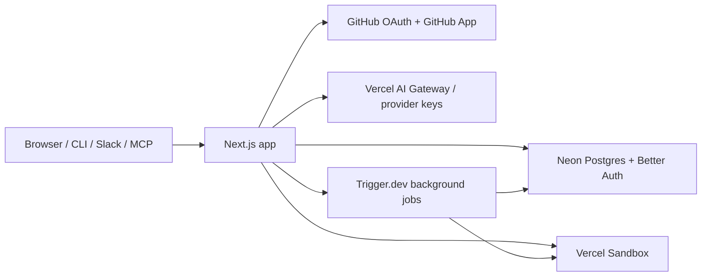

# Mogplex

[](https://github.com/Mogplex/mogplex/actions/workflows/ci.yml) [](./LICENSE) [](https://github.com/Mogplex/mogplex/discussions)

Mogplex is the open-source platform for agent-native software development.

Coding agents plan, build, test, review, and ship inside isolated sandboxes you can watch, on a platform you can read, run, and change. Point it at a GitHub repository and carry work from a trigger (a chat message, a Slack thread, a webhook, a schedule) to a merged pull request, with your gates deciding what ships.

If you have used a hosted agent-development platform and wished you could inspect the harness, swap the model, run it on your own infrastructure, or fix the thing that annoyed you, Mogplex is that platform with the source open.

> Status: pre-1.0. Mogplex is used in production at [mogplex.com](https://mogplex.com), but the product and schema are still moving quickly. Expect rough edges and fast iteration.

## Why Mogplex

- **Agents work in real sandboxes, not a chat window.** Every session gets an isolated [Vercel Sandbox](https://vercel.com/docs/vercel-sandbox) with the repo checked out, a terminal, and a live preview. Agents edit files, run tests, commit, and push from there.
- **Every run is inspectable.** Tool calls, diffs, token usage, cost, and sandbox health are recorded and visible while the run is happening, not reconstructed afterwards.
- **Bring your own model.** Route through Vercel AI Gateway, OpenRouter, or your own provider keys. Defaults are per user, per team, and per automation.
- **Triggers, not just prompts.** Start work from Control chat, a Slack thread, the CLI, the public API and MCP server, a GitHub event, or a cron schedule.
- **Open, Apache-2.0, self-hostable.** Read the harness. Run it on your own Vercel team, Neon database, and Trigger.dev project. Change what you do not like and send it back.

## What You Can Do

- Import GitHub repositories and run agents against them in isolated sandboxes.
- Work in **Control**, the main agent surface: chat with a coordinator that codes directly, see changed files live, diff, revert, commit, and open a pull request without leaving the page.
- Pause long runs at harness checkpoints and resume them later from the pushed branch.
- Run background **automations** on schedules, webhooks, or GitHub events, including a PR review agent.
- Drive repo-bound agent runs from **Slack** DMs and channels, with live actions streamed into the thread.
- Use the **CLI** ([Mogplex/cli](https://github.com/Mogplex/cli)) and the **public API + MCP server** to start, inspect, and control runs from your own tools.
- Manage teams, roles, and an audit log for shared repositories and credentials.
- Inspect runs, tool output, sandbox logs, and per-call model telemetry in the observability views.

## Architecture



| Piece | Role |
| --- | --- |
| Next.js (App Router) | UI, API routes, MCP server, webhooks |
| Neon Postgres | All application state; migrations in [`neon/migrations/`](./neon/migrations) |
| Better Auth | Sign-in (GitHub, Google, email) and sessions |
| GitHub App | Repo access, webhooks, checks |
| Vercel Sandbox | Isolated compute for every agent session |
| Vercel AI Gateway | Model routing, with OpenRouter and direct keys as alternatives |
| Trigger.dev | Long-running agent runs, automations, syncs |

## Getting Started

### Prerequisites

- Node.js `20+` and `pnpm`
- A Postgres 17 database with the `vector` and `pg_trgm` extensions available. [Neon](https://neon.tech) ships both and is what production runs on; locally, the `pgvector/pgvector:pg17` Docker image works.
- Optional, for the full product: a GitHub App, a Vercel token for sandboxes, an AI Gateway or provider key, and a Trigger.dev project. Each unlocks a feature area; none is needed to boot the app shell.

### 1. Install dependencies

```bash
pnpm install
```

### 2. Configure environment

```bash
cp .env.example .env.local
```

The minimum set for a working local app:

| Variable | Purpose |
| --- | --- |
| `MOGPLEX_DATA_BACKEND=neon` and `NEXT_PUBLIC_MOGPLEX_DATA_BACKEND=neon` | Select the Postgres + Better Auth backend. Both must agree; the public one is inlined at build time. |
| `DATABASE_URL`, `DATABASE_URL_UNPOOLED` | Pooled and direct Postgres connections |
| `BETTER_AUTH_SECRET` | Session signing secret |
| `AUTH_GITHUB_CLIENT_ID`, `AUTH_GITHUB_CLIENT_SECRET` | GitHub sign-in (or use Google / email) |
| `NEXT_PUBLIC_APP_URL` | Canonical app URL, `http://localhost:3000` locally |
| `CRON_SECRET`, `INTERNAL_API_SECRET`, `CONNECTIONS_ENCRYPTION_KEY` | Machine auth and credential encryption; generate random values |

Every optional integration is documented inline in [`.env.example`](./.env.example).

### 3. Apply migrations

```bash
pnpm exec tsx --env-file=.env.local scripts/apply-neon-migrations.ts
```

On an empty database this first applies [`neon/baseline.sql`](./neon/baseline.sql), a schema snapshot generated from a fully migrated database, and records every migration it covers as applied. Then, and on every later run, it applies pending [`neon/migrations/*.sql`](./neon/migrations) in order against `DATABASE_URL` and records what ran. Add `--dry-run` to preview. The `--env-file` flag is what lets the script see `.env.local`; in CI and production the variable is exported instead.

### 4. Run

```bash
pnpm dev
```

Open `http://localhost:3000` and sign in.

### 5. Turn on the integrations you need

| Want to | Configure |
| --- | --- |
| Import repos and receive webhooks | GitHub App envs |
| Launch agent sandboxes | `PLATFORM_VERCEL_TOKEN`, `PLATFORM_VERCEL_TEAM_ID`, `VERCEL_PROJECT_ID` |
| Run models | `AI_GATEWAY_API_KEY` or provider keys, or let users bring their own in Settings |
| Run long jobs and automations | Trigger.dev envs, then `pnpm trigger:dev` |
| Slack, Stripe, Sentry, Resend | See the matching sections in `.env.example` |

## Scripts

```bash
pnpm dev          # Next.js dev server
pnpm build        # production build
pnpm lint         # ESLint + Stylelint
pnpm typecheck    # tsc
pnpm test:unit    # unit tests
pnpm test:db      # database-backed tests
pnpm test:e2e     # Playwright
pnpm harness:check
pnpm trigger:dev  # local Trigger.dev worker
pnpm git:cleanup  # return to main and prune merged branches
```

Run one unit test file with `pnpm exec tsx --test tests/unit/some-file.test.ts` and one Playwright spec with `pnpm exec playwright test tests/e2e/some-spec.spec.ts`. First-time Playwright setup: `pnpm exec playwright install --with-deps chromium`. [TESTING.md](./TESTING.md) defines what coverage a change must bring.

## Self-Hosting

Mogplex is built to be self-hosted. The same code that runs [mogplex.com](https://mogplex.com) runs on your own Vercel team, Neon project, and Trigger.dev project, and the Apache-2.0 license has no fee, no seat limit, and no feature gating.

Start with [docs/self-hosting.md](./docs/self-hosting.md). It lists every backing service, what each one unlocks, and the [`Dockerfile`](./Dockerfile) / [`docker-compose.yml`](./docker-compose.yml) path if you prefer containers over Vercel. If something in the self-hosting path is harder than it should be, open an issue or a discussion. Making that path smoother is a priority for the project.

## Deploy Model

Production deploys are schema-first.

- Pushes to `main` run GitHub Actions, which apply pending [`neon/migrations/`](./neon/migrations) before deploying the app.
- After deploy, the workflow hits [`/api/cron/production-smoke`](./app/api/cron/production-smoke/route.ts) with machine auth to catch schema drift on sensitive surfaces.
- Branch previews use the Vercel Git integration.
- Migrations merged to `main` must stay backward-compatible with the currently deployed app until the workflow finishes.

Relevant files: [`ci.yml`](./.github/workflows/ci.yml), [`deploy-production.yml`](./.github/workflows/deploy-production.yml), [`vercel.json`](./vercel.json).

## Project Layout

- [`app/`](./app) - App Router pages, layouts, API routes, MCP server
- [`components/`](./components) - UI surfaces and shared primitives
- [`hooks/`](./hooks) - Client hooks and Zustand stores
- [`lib/`](./lib) - Domain logic, agent harness, integrations
- [`trigger/`](./trigger) - Trigger.dev tasks
- [`neon/migrations/`](./neon/migrations) - Source of truth for schema changes; [`neon/baseline.sql`](./neon/baseline.sql) bootstraps empty databases
- [`docs/`](./docs) - Design docs, audits, and the self-hosting guide
- [`tests/`](./tests) - Unit, database, and end-to-end tests

## Community

- **Questions and ideas**: [GitHub Discussions](https://github.com/Mogplex/mogplex/discussions)
- **Bugs and feature requests**: [Issues](https://github.com/Mogplex/mogplex/issues)
- **Contributing**: [CONTRIBUTING.md](./CONTRIBUTING.md). Small fixes can go straight to a PR; open an issue first for larger changes.
- **Security**: [SECURITY.md](./SECURITY.md). Never file vulnerabilities as public issues.
- **Code of Conduct**: [CODE_OF_CONDUCT.md](./CODE_OF_CONDUCT.md)

Related repositories: [Mogplex/cli](https://github.com/Mogplex/cli) and [Mogplex/docs](https://github.com/Mogplex/docs) (published at [docs.mogplex.com](https://docs.mogplex.com)).

## License

[Apache License 2.0](./LICENSE). See [NOTICE](./NOTICE) for attribution.
