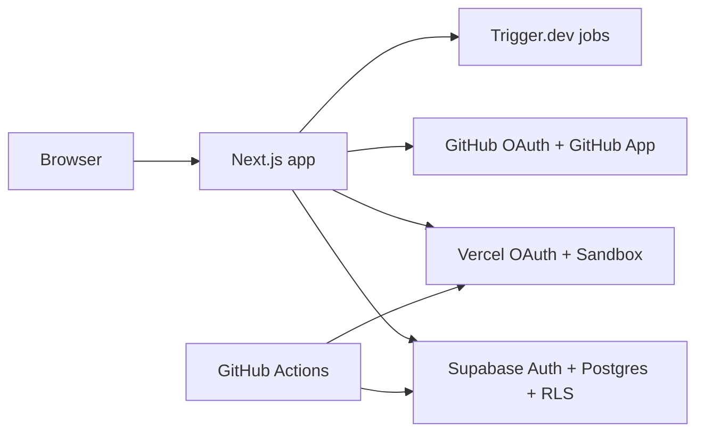

# Mogplex

[](https://github.com/Mogplex/mogplex/actions/workflows/ci.yml) [](./LICENSE)

Mogplex is a browser-native workspace for running AI agents against real repositories.

It brings chat, code, terminal, live preview, automation, and run telemetry into one place so you can move from repo import to working branch to shipped fix without bouncing between tools.

> Status: MVP. Mogplex is usable, but the product and schema are still moving quickly. Expect rough edges and fast iteration until `1.0`.

## Why Mogplex

Most agent tooling still feels detached from the repo it is supposed to operate on. Mogplex closes that gap.

- Open a repo and land in a working workspace, not a disconnected chatbot.
- Split chat, terminal, editor, files, preview, workflows, and observability into the panes you need.
- Launch isolated Vercel sandboxes on the default branch or a fresh branch created for the session.
- Keep repo access, sandbox billing, and model credentials scoped to the user or the platform rules that allow them.
- Track runs, diffs, output, and health in the same place the work is happening.

## What You Can Do

- Import GitHub repos into workspace projects
- Launch repo-bound workspaces with agent chat, terminal, editor, files, and live preview
- Start sandboxes on the default branch or create a new branch before boot
- Connect GitHub and Vercel credentials for repo access and user-billed previews
- Run background jobs through Trigger.dev, with authenticated cron/API fallbacks
- Inspect diffs, runs, tool output, and sandbox health without leaving the workspace

## Architecture



## Inside the Workspace

| Surface | Purpose |
| --- | --- |
| Agent chat | Run agent workflows with repo, sandbox, and connection context |
| Terminal | Execute commands inside the active sandbox |
| Editor | Open and edit files in Monaco |
| Files | Browse the repo tree and open files quickly |
| Preview | Inspect the running app, code view, and health state |
| Workflows | Configure triggers, cron-style tasks, and flow runs |
| Output and diff | Review generated output and code changes |
| Observability | Inspect live calls, run state, and sandbox health |
| Connections | Manage GitHub, Vercel, and model-provider credentials |

## Getting Started

### Prerequisites

- Node.js `20+`
- `pnpm`
- A Supabase project for auth and Postgres
- GitHub OAuth configured in Supabase if you want to sign in and use the app normally
- GitHub App and Vercel access if you want to exercise the full repo-import and sandbox flows locally

### 1. Install dependencies

```bash
pnpm install
```

### 2. Create local envs

Start from [.env.example](./.env.example).

At minimum, the app expects:

- `NEXT_PUBLIC_SUPABASE_URL`
- `NEXT_PUBLIC_SUPABASE_ANON_KEY`
- `SUPABASE_SERVICE_ROLE_KEY`
- `NEXT_PUBLIC_APP_URL`
- `CRON_SECRET`
- `INTERNAL_API_SECRET`
- `CONNECTIONS_ENCRYPTION_KEY`

Boot the app shell:

```bash
cp .env.example .env.local
pnpm dev
```

Open `http://localhost:3000`.

If you keep environment variables in Vercel, pull them instead:

```bash
vercel link
vercel env pull
```

### 3. Apply Supabase migrations

If you are pointing at a fresh Supabase project, apply the checked-in migrations before using repo, workspace, or auth-dependent flows.

```bash
supabase db push
```

### 4. Turn on the integrations you need

Mogplex can boot with a minimal env file, but the main repo-import and sandbox flows only come alive once the right integrations are wired up.

- **Supabase GitHub provider**: enables GitHub sign-in
- **GitHub App envs**: enables installation-backed repo access and webhook flows
- **Vercel OAuth or platform sandbox envs**: enables preview and sandbox workflows
- **Trigger.dev envs**: enables local Trigger-powered background jobs instead of just the fallback routes

See [.env.example](./.env.example) for the optional sections.

## Environment Notes

The repo has a few setup modes:

- **App shell only**: enough for docs work, UI shell work, and static routes
- **Auth + data**: Supabase configured, migrations applied, normal sign-in works
- **Repo and sandbox flows**: GitHub App and Vercel credentials configured
- **Full runtime parity**: Trigger.dev, optional platform AI, and optional memories integration configured

The app is intentionally strict about secrets. Do not commit `.env.local`, live tokens, or copied production credentials.

## Scripts

```bash
pnpm dev
pnpm build
pnpm lint
pnpm typecheck
pnpm harness:check
pnpm harness:sync
pnpm test:unit
pnpm test:e2e
pnpm git:cleanup
pnpm trigger:dev
pnpm trigger:deploy
```

### Testing tips

- Focus a unit test file:

  ```bash
  pnpm exec tsx --test tests/unit/some-file.test.ts
  ```

- Run one Playwright spec:

  ```bash
  pnpm exec playwright test tests/e2e/some-spec.spec.ts
  ```

- First-time Playwright setup:

  ```bash
  pnpm exec playwright install --with-deps chromium
  ```

## Deploy Model

Production deploys are schema-first.

- Pushes to `main` run GitHub Actions, not Vercel Git production deploys
- The production workflow applies Supabase migrations before deploying the app
- After deploy, the workflow hits [`/api/cron/production-smoke`](./app/api/cron/production-smoke/route.ts) with machine auth to catch schema drift on sensitive repo/workspace surfaces
- Branch previews still use the Vercel Git integration
- The service-role-only `slack_tool_executions` ledger temporarily stores unredacted protected-tool results, including possible shell output, for retry replay. RLS exposes no end-user policy, rows are capped at 64 KiB and retained for 24 hours, and incident response or database exports must treat the table as sensitive.

Relevant files:

- [`.github/workflows/ci.yml`](./.github/workflows/ci.yml)
- [`.github/workflows/deploy-production.yml`](./.github/workflows/deploy-production.yml)
- [`vercel.json`](./vercel.json)

## Self-Hosting

The supported way to use Mogplex is the hosted product at [mogplex.com](https://mogplex.com). A [`Dockerfile`](./Dockerfile) and [`docker-compose.yml`](./docker-compose.yml) exist for self-hosters, but they ship the web app only — the database, auth, Trigger.dev, sandbox runtime, and every other backing service are bring-your-own. Read [docs/self-hosting.md](./docs/self-hosting.md) before attempting it.

## Project Layout

- [`app/`](./app) - App Router pages, layouts, and API routes
- [`components/`](./components) - UI surfaces and shared primitives
- [`hooks/`](./hooks) - Client hooks and Zustand stores
- [`lib/`](./lib) - Domain logic, integrations, and product helpers
- [`docs/`](./docs) - Feature plans and integration design docs
- [`supabase/migrations/`](./supabase/migrations) - Source of truth for schema changes
- [`tests/unit/`](./tests/unit) - Unit tests with `tsx --test`
- [`tests/e2e/`](./tests/e2e) - Playwright specs
- [`trigger/`](./trigger) - Trigger.dev jobs and scheduled maintenance work

## Contributing

Start with [CONTRIBUTING.md](./CONTRIBUTING.md) for setup, verification, and PR expectations.

If you contribute with an AI coding agent, the repo-specific maintainer guidance lives in [AGENTS.md](./AGENTS.md).

## Security

Please read [SECURITY.md](./SECURITY.md) before reporting vulnerabilities. Do not open public issues for security bugs.

## Code of Conduct

Participation in this project is governed by [CODE_OF_CONDUCT.md](./CODE_OF_CONDUCT.md).

## License

Mogplex is released under the [Apache License 2.0](./LICENSE). The full license text is included in the repository root, and it applies to every file in this repository unless a file states otherwise.
